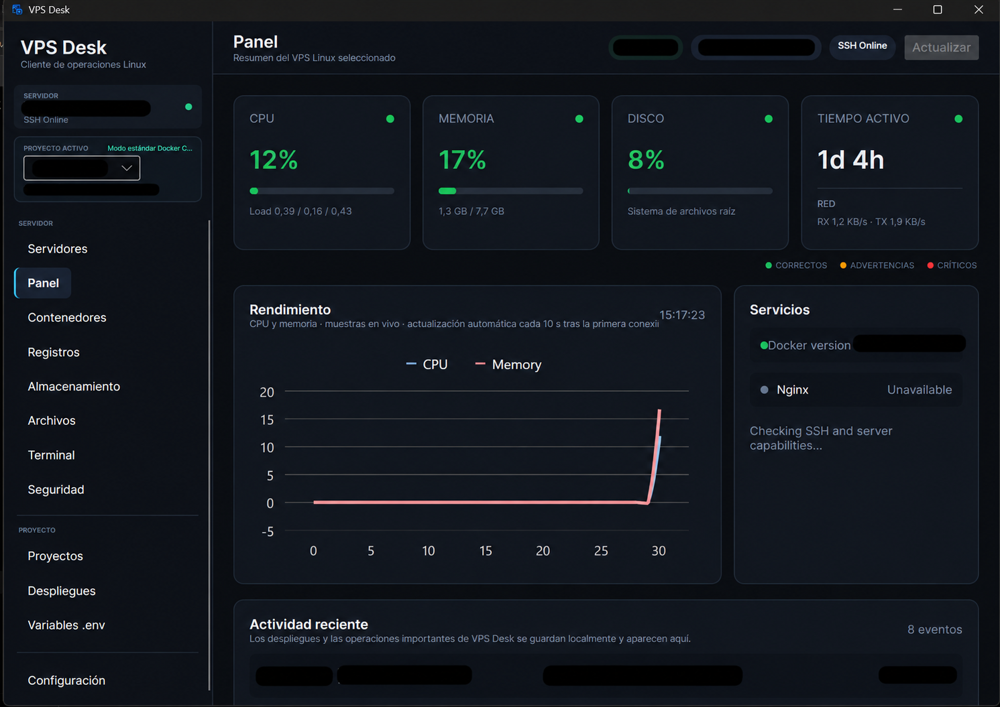
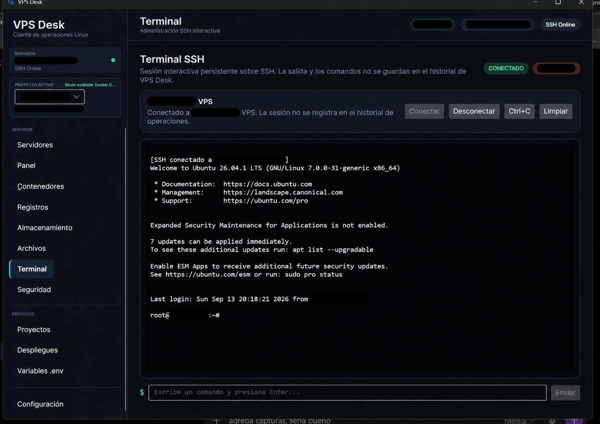
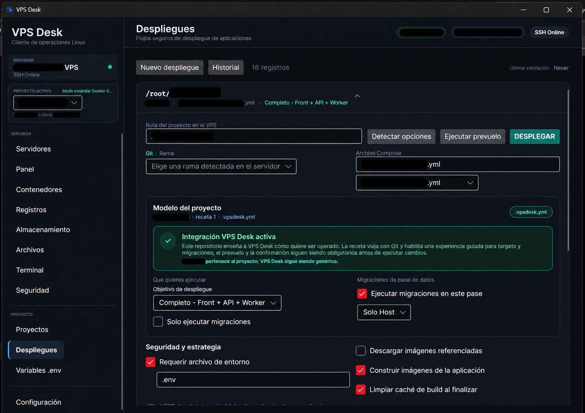

<div align="center">

# VPS Desk

### Administra, observa y despliega en tus VPS Linux desde el escritorio.

**SSH/SFTP · Docker · Deployments · Logs · Métricas · Recetas de proyecto**

[](https://github.com/jmolinap2/VPS-Desk/actions/workflows/avalonia-v2-ci.yml)


</div>

VPS Desk es un cliente de escritorio para administrar VPS Linux **sin instalar un panel web ni un agente propio en el servidor**. Se conecta mediante SSH/SFTP, detecta las capacidades reales del VPS y concentra en una sola interfaz monitoreo, contenedores, despliegues, logs, archivos y auditoría de seguridad.

Hostinger es el primer entorno probado de forma directa, pero el núcleo de VPS Desk no depende de Hostinger: está diseñado alrededor de capacidades Linux estándar.

> **Estado:** la v2 moderna vive actualmente en `main` y está en desarrollo activo.

## Por qué VPS Desk

- **Agentless:** no instala un servicio propietario dentro de tu VPS.
- **Sin panel administrativo público:** opera desde tu equipo por SSH/SFTP.
- **Proveedor independiente:** detecta Linux, systemd, journalctl, Docker, Compose, Git y Nginx en lugar de asumir un proveedor concreto.
- **Operación visual:** métricas, contenedores, logs, archivos y despliegues desde una aplicación desktop.
- **Deployments con preflight:** valida el contexto antes de ejecutar cambios y muestra feedback semántico durante el proceso.
- **Recetas opcionales por proyecto:** cada repositorio puede describir sus targets y migraciones sin acoplar VPS Desk a un framework específico.

## Qué puedes hacer hoy

| Área | Estado | Capacidades |
| --- | :---: | --- |
| Servers | ✅ | Perfiles locales, SSH por llave o contraseña, test de conexión y fingerprint SHA256 opcional |
| Dashboard | ✅ | CPU, RAM, swap, disco, red, load average, uptime, gauges y gráficas |
| Containers | ✅ | Inventario Docker y acciones Start / Stop / Restart con confirmación |
| Deployments | ✅ | Git + Docker Compose, preflight, targets, recetas, migraciones y feedback de ejecución |
| Logs | ✅ | Docker y systemd/journalctl con filtrado y sanitización |
| Storage | ✅ | Uso de filesystem, Docker system df, imágenes y volúmenes en modo de observación |
| Files | ✅ | Navegación SFTP, lectura y edición de archivos de texto con confirmación |
| Security | ✅ | Auditoría de seguridad de solo lectura |
| Terminal | 🚧 | En desarrollo |
| Settings | 🚧 | En desarrollo |

## Capturas

<div align="center">





</div>

## Recetas de proyecto

VPS Desk funciona **sin recetas**. Si detecta un proyecto Git con Docker Compose, puede descubrir sus servicios y ofrecer un despliegue genérico.

Una receta `.vpsdesk.yml` o `.vpsdesk.yaml` es opcional y permite que el propio proyecto describa una experiencia de despliegue más rica:

> **VPS Desk aporta el motor; el proyecto describe su receta.**

Con una receta puedes definir nombres amigables como `Completo`, `Backend` o `Frontend`, agrupar varios servicios Compose en un target y declarar modos de migración propios del proyecto.

### Cómo usar una receta

1. Crea `.vpsdesk.yml` en la **raíz del repositorio que se encuentra en el VPS**.
2. Define `version`, el nombre del proyecto y, opcionalmente, targets de despliegue y migraciones.
3. Asegúrate de que los nombres de `services` coincidan con servicios reales del Docker Compose seleccionado.
4. Abre **Deployments** en VPS Desk y carga el proyecto. VPS Desk detectará la receta y mostrará los targets definidos.
5. Selecciona target, rama y opciones de migración. El preflight valida el contexto antes de habilitar la ejecución.
6. Revisa la confirmación y ejecuta el despliegue.

Ejemplo:

```yaml
version: 1

project:
  name: MiAplicacion

deploy:
  defaultTarget: full
  targets:
    - id: full
      label: Completo
      services: [api, front, worker]
      migrationsDefault: true

    - id: backend
      label: Backend
      services: [api]
      migrationsDefault: true

    - id: frontend
      label: Frontend
      services: [front]
      migrationsDefault: false

migrations:
  label: Migraciones de base de datos
  defaultMode: all
  requiredServices: [postgres, migrator]
  modes:
    - id: all
      label: Todas
      command: docker compose --profile tools -f {{compose}} run --rm migrator -q

    - id: one
      label: Una base concreta
      command: ./scripts/migrate-one.sh {{input}}
      input:
        label: Base
        placeholder: identificador
        required: true
```

### Qué pasa si no hay receta

VPS Desk ejecuta `docker compose config --services` y construye automáticamente opciones para desplegar todos los servicios activos o un servicio individual.

Las migraciones **no se activan automáticamente** sin receta: una herramienta genérica no puede deducir de forma segura cómo debe migrarse una aplicación arbitraria.

### Tokens disponibles en migraciones

Los comandos declarados en una receta pueden utilizar:

| Token | Valor |
| --- | --- |
| `{{compose}}` | Archivo Compose seleccionado |
| `{{repository}}` | Ruta remota del proyecto |
| `{{branch}}` | Rama seleccionada |
| `{{input}}` | Valor del input contextual del modo de migración |

Los valores dinámicos se insertan con quoting de shell. Si queda un token `{{...}}` desconocido, VPS Desk bloquea la operación.

### Seguridad de las recetas

Una receta puede declarar comandos de migración, por lo que debe tratarse como **configuración ejecutable del repositorio**, igual que un Dockerfile, un Compose o un script de despliegue.

VPS Desk valida la estructura y versión, limita el archivo a 128 KB, comprueba servicios requeridos durante el preflight, escapa el input del operador, bloquea tokens desconocidos, exige confirmación antes de ejecutar y sanitiza la salida antes de mostrarla o guardarla en el historial.

**No coloques contraseñas, tokens ni secretos dentro de `.vpsdesk.yml`.** Mantén los secretos en `.env`, en los mecanismos de autenticación correspondientes o en almacenamiento seguro fuera del repositorio.

Documentación completa: [`docs/project-recipes.md`](docs/project-recipes.md)  
Esquema formal v1: [`Schemas/vpsdesk-recipe.schema.json`](Schemas/vpsdesk-recipe.schema.json)

## Flujo de despliegue

Un despliegue normal sigue, de forma general, este flujo:

```text
Git fetch / checkout / pull
        ↓
pull opcional de servicios seleccionados
        ↓
docker compose up de los servicios del target
        ↓
migración opcional definida por el proyecto
        ↓
docker compose ps
        ↓
limpieza opcional
        ↓
postflight limitado al target desplegado
```

Cuando se utiliza **Solo migraciones**, VPS Desk actualiza Git, ejecuta la operación de migración y consulta el estado de Compose sin reconstruir ni recrear la aplicación.

## Primer uso

Necesitas un VPS Linux accesible por SSH. Para una primera conexión:

1. Abre **Servers** y crea un perfil.
2. Introduce host/IP, puerto SSH y usuario.
3. Preferiblemente usa autenticación por **llave privada**.
4. Verifica externamente la huella SSH del servidor y guarda su fingerprint SHA256 si quieres fijar la identidad del host.
5. Ejecuta **Test connection** para validar SSH y detectar capacidades.
6. Activa el servidor y entra al **Dashboard** o a cualquiera de los módulos disponibles.

Las contraseñas y passphrases utilizadas durante la sesión no se guardan como parte del perfil persistente.

## Ejecutar desde código

Requisitos de desarrollo:

- .NET SDK 10
- Git
- un entorno desktop compatible con Avalonia
- acceso SSH a un VPS Linux para probar las funciones remotas

```bash
git clone https://github.com/jmolinap2/VPS-Desk.git
cd VPS-Desk
dotnet restore VpsDesk.slnx
dotnet run --project src/VpsDesk.Desktop/VpsDesk.Desktop.csproj
```

La implementación actual está en `main`; ya no es necesario cambiar a `rewrite/avalonia-v2` para probar la v2.

## Arquitectura

```text
VpsDesk.Desktop
Avalonia · MVVM · LiveCharts2
        │
        ▼
VpsDesk.Application
Casos de uso · abstracciones
        │
        ▼
VpsDesk.Domain
Perfiles · capacidades · métricas · operaciones
        ▲
        │
VpsDesk.Infrastructure
SSH.NET · SFTP · probes Linux
```

Del lado remoto no se instala VPS Desk:

```text
┌─────────────────────┐        SSH / SFTP        ┌─────────────────────┐
│ PC del operador     │ ───────────────────────► │ VPS Linux           │
│                     │                          │                     │
│ VPS Desk            │                          │ SSH                 │
│ .NET 10 + Avalonia  │                          │ Docker / systemd    │
└─────────────────────┘                          └─────────────────────┘
```

## Seguridad

VPS Desk puede ejecutar operaciones administrativas reales. Por eso la seguridad forma parte del flujo de uso y no es solo una capa posterior.

Entre las medidas actuales están el pinning opcional de la clave SSH del host, preflight antes de despliegues, confirmaciones explícitas, quoting de valores dinámicos, sanitización de logs e historial y controles de seguridad en CI. El workflow también audita dependencias NuGet vulnerables antes de completar el build.

No subas al repositorio archivos `.env` reales, llaves privadas, contraseñas, tokens, backups ni logs sensibles.

Consulta también [`SECURITY.md`](SECURITY.md).

## CI

Cada cambio relevante pasa por el workflow **Avalonia v2 CI**, que incluye controles de seguridad, validación de localización, restore, auditoría de dependencias, build Release y un smoke test gráfico. Los pushes configurados también pueden producir un build Windows x64 self-contained de prueba como artifact de GitHub Actions.

## Código heredado

Los scripts PowerShell/WPF existentes en la raíz se conservan temporalmente para no perder capacidades durante la migración. No representan la arquitectura objetivo de VPS Desk v2 y se retirarán cuando exista paridad funcional comprobada.

## Documentación

- [`docs/project-recipes.md`](docs/project-recipes.md) — recetas de proyecto y despliegues personalizados.
- [`Schemas/vpsdesk-recipe.schema.json`](Schemas/vpsdesk-recipe.schema.json) — esquema formal de recetas v1.
- [`docs/IMPLEMENTATION_STATUS_V2.md`](docs/IMPLEMENTATION_STATUS_V2.md) — estado de implementación.
- [`docs/ARCHITECTURE_V2.md`](docs/ARCHITECTURE_V2.md) — arquitectura objetivo.
- [`docs/UI_SPEC_V2.md`](docs/UI_SPEC_V2.md) — especificación de interfaz.
- [`docs/PRODUCT_ROADMAP.md`](docs/PRODUCT_ROADMAP.md) — roadmap funcional.

## Licencia

MIT. Consulta [`LICENSE`](LICENSE).

---

<div align="center">

**VPS Desk — control de tu VPS sin convertirlo en otro servidor que administrar.**

Si el proyecto te resulta útil, puedes marcarlo con una ⭐ para seguir su evolución.

</div>
